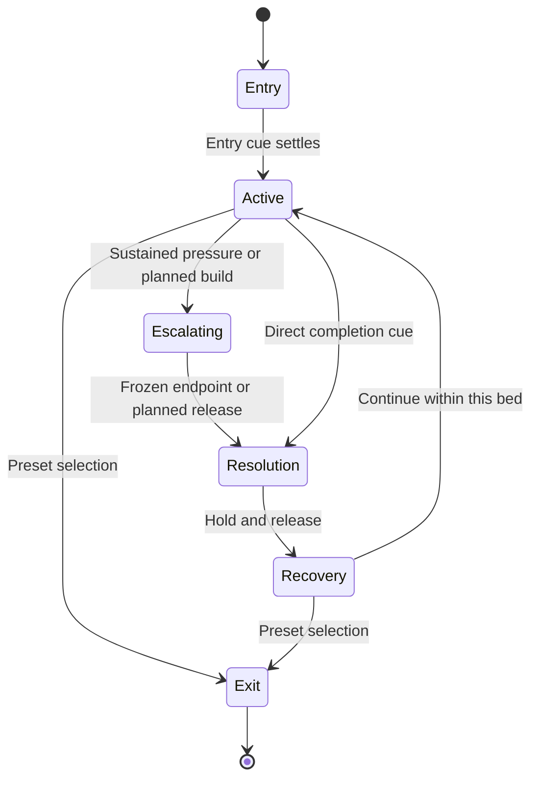

# HUD animation beds: preset design and production contract

Status: proposed preproduction design, 2026-09-28. This document defines how to build the next generation of presets. It does not establish that the song scanner, shared HUD format, cue engine, or the stock-AAAVS integrations described below already exist. No game assets have been extracted or rendered for this document.

Read alongside [Song analysis and reusable HUD drivers](SONG-ANALYSIS-AND-HUD-DRIVERS.md). That document owns audio analysis, caching and the musical timeline. This document owns what a HUD does with that information, how it should feel, and what an asset teardown must supply.

## The creative decision

A HUD preset is a living instrument scene with its own visual identity and dramatic behavior. It should still feel like the source game's dashboard when the music is quiet. The music gives its instruments purpose: a round develops, a battery runs down, a target is acquired, a lap ends, or a score accumulates.

Build a small library of reusable behaviors beneath many distinct visual skins. Reuse a counter's timing and seeking logic, but do not make a racing dashboard, fighting-game round and NERV emergency look or move alike. Keep the original layout, hierarchy, typography and characteristic movement as the identity of each scene.

The three inputs have different jobs:

1. **Measured audio** supplies energy, transients, spectral distribution and stereo activity.
2. **A musical map** supplies trustworthy time anchors, beat positions and repeated regions when available.
3. **An authored scene plan** turns those facts into game-like fiction: damage, rounds, charge, checkpoints and mission states.

A low-frequency onset is evidence of an audio event. Calling it a hit, shot or gear change is a preset design choice, not a claim that analysis recognized one in the music.

## One design for stock AAAVS and MPC-HC-AAAVS

Both hosts should consume the same component definitions, asset manifests, cue plans, driver evaluator and scene renderer. Host adapters provide the playback clock, available features, storage and user commands. A new preset should not require a second hand-authored implementation for the other host.

- Canonical shared behavior includes signal normalization, confidence gates, exact counters, seek reconstruction, seed generation, scene states, transitions and preset eligibility rules.
- Browser AAAVS and the native player expose their actual capabilities. Missing file-renaming, scanning or metadata support must be reported through the adapter rather than simulated as success.
- Host layout and controls remain host-specific. The visual composition stays independent of player toolbars, dialogs and window chrome.
- Future features enter the shared contract first, with explicit compatibility/version handling and host conformance checks. Keep fallback behavior in the preset contract, not in an undocumented fork of each renderer.
- Bundled preset IDs must be stable across hosts. Ratings, not-working state and setup references must not depend on the display filename alone.

This is the target portability contract. It is not a claim that the two current codebases already satisfy it or that all host-specific native functionality can run unchanged in a browser.

## The five layers of an animation bed

| Layer | Job | Typical behavior | Constraint |
| --- | --- | --- | --- |
| Identity | Make the source immediately recognizable | Frames, labels, empty meter rails, glyph style, aspect ratio | Usually stable; preserve reading order and reference proportions. |
| Ambient | Keep a quiet scene alive | Slow radar sweep, cursor blink, machinery drift, restrained scan texture | Low visual priority; no false alarms when audio is silent. |
| Instrument response | Show the changing sound | Needle movement, spectral columns, target drift, stereo indicators | Different instruments need different signals and time constants. |
| Event accents | Give rhythm physical weight | Hit spark, warning tick, score increment, lock confirmation | Short, bounded and rate-limited; avoid every object firing together. |
| Dramatic progression | Give a scene a beginning and destination | Round timer, battery depletion, checkpoint, recovery, result | Driven by an authored interval and state plan, with exact endpoints. |

An initial authoring rule is one primary dramatic action, two supporting instrument groups and a quiet background per scene. This is a composition starting point, not a renderer limit. Dense source HUDs may contain many instruments, but only a few should compete for attention at once.

Debug information belongs in a separate optional overlay. Do not automatically place BPM, analyzer confidence, PCM formats or preset implementation details inside every game's visual skin.

## Temporal grammar

| Scale | Useful input | Visual use | Avoid |
| --- | --- | --- | --- |
| Immediate texture | Waveform, spectral bands, pan | Scope trace, exhaust tremor, fine targeting movement | Large layout movement at audio rate. |
| Short event | Transient strength or a selected onset class | Impact, score tick, reticle flash | Calling frequency heuristics isolated drums or stems. |
| Beat cycle | Explicit beat phase, otherwise an authored clock | Cursor cadence, sweep, segmented charge | Deriving every visual phase from one global BPM during tempo changes. |
| Several beats/bars | Authored interval or reliable meter grid | Combo opportunity, gear sequence, alert cycle | Pretending a fixed interval is a detected musical phrase. |
| Musical region | Trusted boundary/repetition ID | Round change, scene mode, checkpoint, emergency recovery | Requiring verse/chorus labels when only repeated A/B regions are known. |
| Whole track | Known media duration and selected show plan | Campaign progress, total score, final resolution | Treating a five-minute analysis chunk as a new song or new level. |

Timing values should be authored in the unit that expresses their purpose. An impact has a short attack/release in seconds. A radar revolution may span four beats. A battery reaches zero at a selected media-time boundary. A pixel-art text crawl may deliberately use discrete steps. A blanket beat multiplier cannot replace these distinctions.

## Reusable instrument kit

Each instrument separates its static skin, dynamic display, timing authority and optional live decoration.

| Component | Main authority | Secondary response | Required authoring decisions |
| --- | --- | --- | --- |
| Numeric counter | Interval interpolation or cumulative event total | Small digit emphasis on increments | Start/end, rounding, overflow, digit capacity, grouping and reset scope. |
| Countdown | Frozen future endpoint | Urgency treatment near the endpoint | Units, display cadence, zero hold, completion cue and unknown-end fallback. |
| Health/battery bar | Monotonic progress or authored state | Delayed trail, warning accent | Fill direction, exact empty/full extents, trail decay and restore event. |
| Charge meter | Bounded integrated activity or authored progress | Transient accents | Leak rate, saturation, discharge rule and seek reconstruction. |
| Needle/tachometer | Smoothed relative energy or activity | Small bounded tremor | Range, rise/fall damping, dead zone and overrange behavior. |
| Score/combo | Deterministic weighted event ledger | Local hit flashes | Increment scale, debounce, combo window, reset scope and maximum width. |
| Radar/targeting | Beat/media phase plus seeded trajectories | Stereo/spectral displacement | Sweep period, clipping, target count, lock rule and event lifetime. |
| Segmented strip | Quantized continuous signal | Peak/hold marker | Segment count, threshold spacing, hysteresis and smoothing. |
| Text/status terminal | Authored state/cue | Optional per-event reveal | Line limits, reveal units, pause behavior and completion policy. |
| Lives/round/checkpoints | Explicit scene events | Local confirmation animation | Maximum count, depletion/recovery rules and persistence. |

Bars need an empty rail and full usable fill geometry. A screenshot of a half-full bar is not sufficient evidence for the hidden half. Digits need an observed or separately sourced glyph set, or an explicitly authored replacement. Preserve unresolved asset requirements instead of inventing pixels.

## Signal design: make the whole spectrum useful

Use distinct spectral roles rather than mapping all movement to bass loudness. Normalize against a declared reference window or cached track/region statistics, apply noise floors, and retain headroom. The normalization method is part of the plan version so replay does not quietly change when a later chunk arrives.

- **Low energy:** broad mass, force, shield stress or engine load. Favor slower movement with weight.
- **Mid energy/activity:** machinery detail, tactical activity, score opportunities or communications texture.
- **Upper bands/brightness:** fine markers, small electrical detail, sparks and short accents. Use suitable gain and thresholds; low absolute high-band energy should not make these controls permanently inert.
- **Stereo balance/width:** lateral targeting and separation within a bounded range. Mono gets a centered, deliberate composition.
- **Transient strength/density:** individual events and escalation rate. Dense material should saturate into a stable busy state instead of creating unlimited flashes.
- **Slow energy contour:** pressure, acceleration, threat or relief across a region.
- **Known musical boundaries:** irreversible story actions such as round results and battery completion.

Every binding records units, range, curve, attack/release, dead zone, hysteresis, maximum event rate, confidence requirement and fallback. Calibrate low/mid/high independently. A source-specific palette should not become a continuously changing rainbow just because chroma data exists.

Maintain one attention controller per scene. It budgets large alerts, impact accents and text changes together. A warning panel can suppress subordinate sparks for its duration while the underlying meters keep running. Expose reduced-motion and flash-limited presentation through the same shared policy; do not make every preset invent its own safeguard.

## Authored progression and exact endpoints

For a cue with frozen start `a` and end `b`, evaluate progress directly from media position: `p = clamp((t - a) / (b - a), 0, 1)`. Reject or resolve invalid/zero-length intervals explicitly. Endpoint values are exact and independent of frame rate. Use beat-position lookup when the chosen interpolation is musical rather than linear in seconds.

A countdown uses remaining media time, a score uses a deterministic ledger, and a health bar can use a monotonic authored curve. They need not all have the same curve. A monotonic curve shaped by cached activity may accelerate during dense moments and slow during breaks while retaining its intended start and finish. Live audio may decorate the bar or its trailing ghost; it does not move the frozen deadline.

For a countdown displayed in whole seconds, define rounding deliberately: positive time uses ceiling, the endpoint and later use zero. Display cadence must not determine when completion is emitted. Time and beat counters must name their units.

Each cue declares:

- Stable cue ID, start anchor, end anchor and resolved media positions.
- Range, interpolation/quantization and completion state.
- Whether analysis is provisional, the accepted revision, and the horizon that justified the endpoint.
- Persistence scope: event, cue, scene instance, repeated musical region, setup or track.
- Entry policy when playback starts or seeks inside the cue.
- Repeat policy and seed derivation.
- Missing-data fallback, interruption policy and priority relative to automatic preset changes.

Do not chase a shifting predicted ending. Commit the active interval; apply improved analysis to a later interval. If the ending is unknown, use a clearly authored fallback cycle, a non-countdown activity display or a source-appropriate standby state. An invented timer must not be presented as a countdown to an analyzed chorus or drop.

## Scene state and dramatic variety

These are authoring roles, not an obligatory sequence in every preset. A calm instrumental can remain active for a long interval; an abrupt region can resolve without a build. Silence can enter standby without declaring a boss defeated. A repeated musical region may recall the same mode, color emphasis and instrument arrangement while preserving track-level score.

Mode selection uses stable rules and minimum dwell time. Reserve randomness for bounded detail: which target appears, which indicator group answers, which text line is selected. Seed it from stable track/show-plan identity, preset ID and cue ID. Do not draw a fresh random decision every frame or use file paths as seeds.

## Five pilot families

### 1. Arcade score and lives

**Feeling:** crisp, economical, readable from across a room. The score is the main evolving detail; lives and stage markers give it structure.

- Score grows from a weighted, debounced event ledger. Quiet sections still retain the world and accumulated progress.
- Low, mid and high transient groups contribute different visible event types instead of three unrelated score counters. Fixed rules map them to points.
- A combo rises with sustained activity and closes after an authored inactivity window. A deterministic prefix/checkpoint representation reconstructs it after a seek.
- Stage progress follows the current cue interval. A life loss is an explicit planned tension event, not every bass hit.
- Repeated regions can revisit the same stage palette. A result panel briefly presents a frozen total at the planned end, then returns to activity.

**Assets:** frame, labels, exact digit atlas, lives icon, empty/full progress geometry, stage/result panels and observed effect variants.

**Pilot proof:** seek halfway through a dense region and obtain the same score, combo state and lives as uninterrupted playback without replaying all increments onscreen.

### 2. Fighting-game round

**Feeling:** two sides in tension, legible bars, decisive short impacts and a satisfying end-of-round hold.

- The round timer and intended health endpoints share an explicit round interval.
- Distribute authored damage across selected transient events; cached cumulative activity can weight the distribution while preserving the planned final values. A ghost trail follows damage with separate decay.
- Side assignment is deterministic and bounded. Stereo may bias impact placement; mono remains balanced. Do not claim left and right channels are opponents or separated instruments.
- Super/charge meters may react faster than health. Their discharge is a planned event with a cooldown, not repeated threshold chatter.
- The winner, draw or unresolved ending is chosen in the authored plan; a louder channel does not establish a real gameplay outcome.
- Recovery or a new round restores health explicitly. Small energy fluctuations never refill damaged health.

**Assets:** both rails/fills/endcaps, portraits, timer glyphs, round markers, charge strips, impact frame variants, result overlays and clipping masks.

**Pilot proof:** health remains monotonic within a round, the timer reaches zero exactly, and a seek to the result hold reproduces the correct outcome.

### 3. Racing cockpit

**Feeling:** inertia, acceleration and continuous forward progress, with infrequent strong checkpoints.

- A damped relative-energy/activity signal drives tachometer response. Speed is a smooth authored instrument value, not a physical speed measured from music.
- Gear changes use explicit hysteresis and dwell time or an authored cue sequence. Each change can make a brief needle dip without oscillating between gears.
- Lap distance uses monotonic cue progress. A checkpoint is a planned internal marker; a lap ends at the selected boundary even if the music becomes quiet.
- Upper-band texture drives small road/engine details. Stereo drives restrained lane or steering variation without shifting the dashboard itself.
- Slow contour controls an acceleration/cruise/coast mode. Pauses freeze travel; silence may coast visually only while media time advances under the chosen plan.

**Assets:** dial face, needle with pivot, bezel, numeric displays, gear glyphs, minimap/route, progress cursor, warning lamps and masks.

**Pilot proof:** a needle remains stable on a sustained tone, gear logic does not chatter, and distance/lap state survives seeking and tempo changes.

### 4. Cockpit and targeting

**Feeling:** independent instruments observing a shared situation, with purposeful acquisition rather than arbitrary blinking.

- Sweep phase follows explicit beat positions or a declared free-running media-time cycle when beat confidence is weak.
- Targets follow seeded trajectories evaluated from position. Spectrum and stereo supply bounded displacement, intensity or target-class detail.
- A selected target acquires, locks, holds and releases over a cue interval. A lock event is not emitted every frame while a threshold remains high.
- Reticle motion has damping and travel limits. Text updates on meaningful state changes; tiny telemetry is slower than the reticle.
- Threat escalates from sustained density/energy or a planned build, then resolves at a trusted endpoint. Quiet regions retain a low-activity scanning mode.

**Assets:** housing/grid, sweep layer or procedural geometry, circular clip, reticles, blips, vector markers, text/glyphs and alert panels.

**Pilot proof:** mono audio, silence and low beat confidence remain visually coherent; seeking yields the same target and lock state without a backlog of alerts.

### 5. NERV emergency cycle

**Feeling:** an institution under pressure: measured instrumentation, controlled escalation, a hard deadline and a deliberate recovery.

- Battery countdown and fill share one frozen interval. The warning state may begin at a remaining-time threshold, independent of instantaneous bass.
- Sync/pressure instruments use distinct bounded low/mid/high responses. A scan or radar supplies quieter motion beneath the main counter.
- Status text reveals according to an authored entry phase; jumping into the scene shows the appropriate accumulated text rather than rebooting a full introduction.
- Escalation changes alert hierarchy and instrument activity. Completion gets a brief zero/terminal-state hold, then recovery or the next planned state.
- A cumulative diagnostic/operation counter provides a second timing behavior alongside the countdown.

**Assets:** retain the existing procedural NERV lane, then add only the references/components required for new scene designs.

**Pilot proof:** one countdown, one cumulative counter and one scene transition work over a tempo change, a seek, a repeat and an analysis chunk seam.

The current NERV renderer is live/procedural, but some internal animations remain local fixed cycles. In `visualizer/src/nerv-scenes.ts`, the battery uses a repeating 16-beat calculation and boot text reveals from local elapsed time. Changing the current setup's scene length does not automatically retime those internal actions. Adapting them to the new cue contract is explicit implementation work.

## Scene changes versus preset transitions

A state change inside a bed should preserve its frames, major anchors and visual language. It might alter the target, warning mode, round status or selected instrument. It does not need a full-screen transition.

A preset transition changes the composition. Keep the existing selection/filter logic authoritative, including ratings and not-working exclusions. The musical scheduler chooses when an eligible transition can start; it does not bypass catalog eligibility to meet a cue.

| Situation | Design policy |
| --- | --- |
| Ordinary automatic change | Choose a future eligible boundary, preload the next preset, then perform its declared transition. |
| Active critical countdown | Prefer transition after the endpoint and its short completion hold. Do not move the counter's endpoint to fit a default fade. |
| Hard authored change at the endpoint | Shorten or choose a suitable transition before commitment; preserve the endpoint event and define whether the old terminal display remains visible. |
| Manual next/previous | Honor the command promptly using a safe interruption path. Cancel obsolete exit cues and avoid a later stale completion overlay. |
| Compatible HUD skins | A shared anchor/mask transition may be authored when geometry matches; otherwise use a tested generic compositor. |
| Unknown next musical boundary | Use the declared repeatable scene clock or a bounded waiting policy. Do not invent structure. |

Transition envelopes have start, peak and end anchors. For variable tempo, resolve beat anchors through the actual timeline. Evaluate outgoing and incoming scenes from the same media clock while keeping separate scene instance IDs. Both may render during a fade, but only one owner emits user-facing completion/status events for a cue.

Track-level score may survive a compatible skin switch if the setup explicitly shares that ledger. Health, temporary locks and alarms reset by default with their scene instance. Arbitrary unrelated presets must not accidentally inherit each other's game fiction.

## Arrival, seeking, pause and analysis changes

- **Track load at the start:** allow an authored entry, without delaying playback for scanning or animation.
- **Switch into a scene mid-track:** evaluate its selected cue interval at the current position. Entry decoration can be brief, but must not reset the authoritative timer.
- **Seek:** reconstruct persistent state, discard obsolete transient envelopes, and show only effects active at the destination. Do not catch up missed events with a burst.
- **Pause:** freeze media-time animation and counters. A separate explicitly enabled UI hover animation is not part of the musical bed.
- **Repeat:** reuse the same fixed show plan and seed to reproduce cue choices. Live fine texture may vary unless cached feature replay is selected.
- **Late analysis:** revise future uncommitted cues at a safe boundary. Pin active cue endpoints, normalization references and outcome decisions.
- **Track change:** clear track-scoped state, cancel stale jobs and invalidate late messages by generation.
- **Unsupported or weak data:** select the preset's declared fallback. No constant fake confidence, compulsory four-beat bars or fictitious semantic labels.

## Asset teardown contract

The screenshot-research session should produce evidence and construction parts, not a flattened imitation of the whole scene. For each source capture preserve original pixels, dimensions, reference identity and the existing wiki/source connection.

Minimum useful package:

1. Annotated overview with stable element IDs and a parent/group hierarchy.
2. Exact rectangular crops at source resolution, with source bounding boxes and visible context where needed.
3. Separate static frame/label, dynamic content, foreground/occluder and clip/mask where the source supports that split.
4. Layout metadata: source canvas, normalized and pixel coordinates, parent-relative position, z-order, anchor, pivot, padding, aspect policy and optional nine-slice boundaries.
5. A native-scale contact sheet and a nearest-neighbor enlarged view for pixel art.
6. An assembly guide, supported states/glyph inventory and unresolved reconstruction list.
7. A manifest that distinguishes exact crop, observed isolation, approximate isolation, occluded, reconstruction-needed and reference-only assets.

Do not infer invisible backgrounds, transparency, missing digits, fully extended fills or animation frames from one screenshot. A rectangular crop can remain a valid reference even when it cannot be cleanly composited. Keep the original and any reconstructed derivative separate, with the derivative clearly identified.

Use repository-relative asset references in shared manifests. Keep private source lookup paths out of portable packs. Preserve available provenance and included notices; an asset's technical extraction quality does not establish distribution permission.

## Proposed preset authoring contract

This is a design checklist, not the current runtime's accepted JSON schema. Implement and version a schema before marking a pack ready for import.

| Area | Required content |
| --- | --- |
| Identity | Stable preset ID/version, title, family, era/platform, source/reference provenance. |
| Composition | Design canvas, aspect/scaling policy, groups, layers, anchors, masks and clipping. |
| Assets | Relative references, dimensions, extraction status, glyph coverage and unresolved substitutions. |
| Components | Reusable type/version, geometry, skin, value formatting and visibility policy. |
| Bindings | Signal ID/units, transform, normalization, attack/release, gates, thresholds, limits and fallback. |
| Cue plan | Start/end resolution, interpolation, outcome, state transitions, persistence and interruption rules. |
| Capabilities | Required/optional analysis, minimum coverage/confidence, host storage/asset requirements. |
| Replay | Seed inputs, fixed plan revision, checkpoints/prefix totals and cached/live feature policy. |
| Transitions | Allowed entry/exit methods, anchor compatibility and critical cue handling. |
| Presentation | Palette, typography, motion profile, flash/reduced-motion policies and optional debug overlay. |
| Budget | Maximum elements/events/targets, texture footprint and transition coexistence target. |
| Validation | Component tests, fixture IDs, extraction review status and visual acceptance status. |

Keep a skin's visual constants separate from behavior parameters. One battery behavior can have NERV, handheld LCD and arcade skins without copying its arithmetic. Conversely, a shared bar skin may represent health, charge or progress with different semantic rules.

## Fidelity and performance decisions

- Preserve original proportions; letterbox or author a deliberate responsive arrangement. Never stretch a circular radar or pixel glyph to fill a widescreen host.
- Pixel art uses an explicit logical grid and integer/nearest sampling policy. Motion may intentionally step at a lower cadence while timing evaluation stays accurate.
- Vector, CRT, LCD and modern HUD styles get different motion and material profiles. Scanlines or glow are restrained finish treatments, not substitutes for source geometry.
- Static layers are candidates for precomposition/caching. Dynamic fills, digits and masks stay separate. Share atlases where useful without destroying per-element provenance.
- Bound transient populations, text updates, target counts and animation queues. Define degradation in order: remove optional texture first, then reduce secondary detail, while keeping the primary timer and state readable.
- Budget the overlap of two scenes during a transition. A scene passing alone is not proof that its transitions meet the same cost target.
- Establish numerical rendering budgets from measured target hardware before mass production. This document's composition guidance is not a performance benchmark.

## Production sequence and acceptance

1. **Contract and CPU fixtures:** implement a host-neutral cue evaluator and the counter, bar, event ledger and state primitives. Use synthetic timelines and fixture feature curves; no GPU is required for these checks.
2. **NERV adaptation:** prove exact endpoints and mid-scene arrival using existing procedural assets. Keep the old scene clock as an explicit fallback.
3. **One extracted HUD:** complete one screenshot teardown through manifest, assembly, animation bindings and visible acceptance. Resolve missing digits/fill geometry before batching more captures.
4. **Five pilot families:** build the distinct behaviors above, sharing components while preserving their visual differences.
5. **Two-host conformance:** feed the same media positions, fixture features, plan and seed into stock AAAVS and MPC-HC-AAAVS. Compare component states and cue events; separately validate each host's live playback/clock adapter.
6. **Catalog rollout:** expand only after the import contract, asset-quality gates and authoring workflow are stable. Track source coverage separately from usable animated presets.

CPU acceptance covers endpoint exactness, event deduplication, seek equivalence, pause/repeat, odd/partial meter, tempo ramps, silence, low confidence, missing bands, mono/stereo, chunk seams, stale-job rejection, bounded event populations and empty eligible preset pools. A full-band synthetic sweep should visibly affect each intended instrument in a later visual check; a numerical response alone does not prove it reads well onscreen.

Visual acceptance covers recognizable source identity, readable digits, believable mass/damping, complete high/mid/low response, quiet-scene quality, no distracting global pulsing, correct masks/pivots, aspect behavior and transitions at normal viewing size. Live audiovisual acceptance additionally covers timing alignment in both hosts. Source tests, mocked canvases and CPU fixture passes do not establish these visual or live results.

The first finished demonstration should be deliberately small: a NERV battery reaches its exact deadline while a diagnostic counter accumulates and secondary instruments respond across the spectrum, then a planned transition resolves into the next scene. Repeat and seek through it before increasing the catalog.
