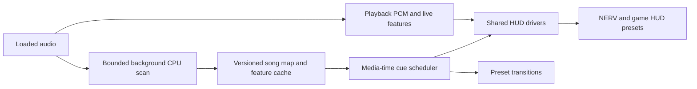

# Song analysis and reusable HUD drivers

Status: proposed architecture, reviewed against the current source on 2026-09-28. A CPU song map (chunked worker scan, progressive revisions, cache, live fallback, `SongMapClock`) is now implemented; see `docs/SONG-MAP.md` for what exists, the native bridge additions it still needs and what is unverified. The rest of this document remains the design. No models were installed and no audio files or tags were modified for this review.

## Decision

Build one shared, versioned musical timeline and HUD driver system before expanding the preset catalog. Every preset consumes the same analysis, clock, confidence and cue definitions. Keep classic AVS input compatible; add richer signals alongside it for authored HUD presets.

A song map gives the visual system advance knowledge of musical boundaries. Live audio supplies immediate texture. An authored scene plan decides how those musical facts become a score, health bar, radar, countdown or scene transition.

## What can be reused now

- `visualizer/src/offline/analyzer.ts`: deterministic spectral analysis, multiband novelty, onset events, RMS, peaks, centroid and flux. Extract its streaming kernels; do not copy its whole-file allocation strategy.
- `visualizer/src/offline/model.ts` and `timebase.ts`: sample-position records, tempo authority and rational timing. Separate source analysis from the existing preset/render schedule.
- `visualizer/src/timeline.ts`: explicit beat timestamps, binary-search seeking, structural-event slots, look-ahead scheduling, seeded triggers and start/peak/end envelopes.
- `visualizer/src/contracts.ts`: richer audio snapshots, perceptual bands, stereo placement, envelopes and rhythmic trigger definitions.
- `visualizer/src/mpc-scene-clock.ts`: repeatable selection, seeded shuffle, queued scene choices and media-time evaluation. Preserve existing setup behavior as a fallback.
- The existing host already sends decoded PCM to AVS/NERV, performs preloading and protects transitions. The recent rating and not-working filters remain part of every automatic preset choice.

Important gaps: the MPC bridge does not yet publish a scan job's track identity, duration or analysis revision. Its current Auto grid and NERV scene clock use four-beat bars. The offline analyzer requires supplied BPM/downbeat; its export segments are fixed-duration editorial buckets, not song sections. StaticTimeline assumes perfect grid confidence and four-beat downbeats. Its audio-context clock contract must be adapted to MPC media position before reuse.

The separate BPM browser provides an incremental libkeyfinder API and a persistent worker-process pattern. Its whole-file decoding, fixed 30-60 second key sample, simple BPM estimator, metadata writer and unbounded queue should not be copied into the player.

## Scan lifecycle

1. On track load, publish an opaque track ID, selected audio-stream identity, media duration, source-to-player timestamp mapping and cancellation generation. The renderer never needs an absolute media path.
2. Check for compatible cached analysis. Start playback immediately using cached data or the existing live analysis.
3. On a cache miss, prioritize a short initial analysis region and a cheap sequential feature pass. Early rhythm results are provisional, not a promise that the whole song has been understood.
4. For files up to five minutes, schedule one logical analysis job, streaming small PCM blocks inside it. For longer files, schedule five-minute core regions with additional context.
5. Prioritize the region around the playhead, then the next region, then remaining regions. A seek reprioritizes work; a track change cancels obsolete jobs and rejects their late messages.
6. Run global structure refinement over compact, beat-synchronous features. It must compare repeated material across chunk boundaries, including distant repetitions.
7. Publish coverage and confidence by region. Replace future cue plans at a safe musical boundary; keep an active countdown's selected endpoint stable.
8. Save validated results atomically. Future loads should reuse the map; analyzer, model or audio-content changes invalidate the relevant results.

### Five-minute chunks

Five minutes is a memory/scheduling boundary, never an automatic scene boundary or a fresh musical intro. For example, core regions 0:00-5:00 and 5:00-10:00 may analyze 0:00-5:30 and 4:30-10:30 respectively. The example's 30-second overlap is an initial parameter to benchmark, not a universal model requirement.

- Maintain absolute sample timestamps throughout. Remove duplicate edge events and reconcile phase, tempo and section IDs in shared context.
- Stateful filters should carry state across contiguous blocks. Independent parallel blocks need explicit warmup/context and discard rules.
- A section crossing 5:00 remains one section. Track-end padding is not evidence of an outro. A chunk edge cannot justify a semantic label.
- For long DJ sets, keep a coarse global feature index and bounded/sparse similarity search; avoid a dense frame-by-frame matrix whose memory grows quadratically.
- Separate analysis coverage from confident musical coverage. Decoding a region does not mean its downbeats or section labels are reliable.

### CPU and memory budget

Start with one streaming decoder and at most two background analysis workers, at reduced priority. Limit each numerical library's internal thread count so two jobs do not each occupy every core. Use bounded queues, backpressure, deadlines and cancellation. Cache compact features rather than decoded PCM.

Five minutes of 48 kHz stereo Float32 PCM is 115.2 MB before decoder buffers and copies. A five-minute logical job therefore must not imply copying that buffer into every worker. GPU inference remains disabled by default. Optional richer analysis needs measured CPU latency/memory before it becomes a default dependency.

## Musical data and confidence

The song map should contain:

- **Identity/provenance:** schema version, audio-content identity, decoder/resampler version, analyzer/model/config version, analysis revision and manual corrections. Keep filesystem location in a private lookup, separate from shareable analysis.
- **Coverage:** analyzed regions, pending regions, provisional/finalized status and the horizon of trustworthy future events.
- **Rhythm:** explicit beat timestamps, downbeats, meter regions, local tempo curve, confidence/quality evidence and alternative half/double-time hypotheses when unresolved.
- **Structure:** boundary estimates, repeated-region IDs, optional intro/verse/chorus/bridge/break/outro labels, label and boundary confidence separately. Unknown/A/B labels are valid results.
- **Continuous features:** energy at several timescales, spectral bands, onset density, brightness/flatness, stereo balance/width, chroma/key candidates and relative dynamic range.
- **Events:** transient candidates, silence entries/exits, builds, energy releases and structural changes, each with a source and confidence. Frequency-band peaks alone do not establish a true isolated kick, snare or vocal.
- **Optional enhanced features:** separated-stem envelopes, vocal activity and stronger semantic labels from a separately validated backend.

Do not force every track into 4/4 or a single BPM. Preserve pickups, partial ending bars, rubato and ambiguous meter. A model score is not automatically a calibrated probability. Keep raw evidence and user overrides instead of inventing certainty. Preserve original boundary estimates when a separate rendering policy snaps a cue to a nearby beat/downbeat.

## Shared HUD drivers

| Driver | Musical input | Example use |
| --- | --- | --- |
| Beat/bar phase | Beat and downbeat positions | Radar sweep, cursor cadence, rhythm markers |
| Event envelope | Onset with attack/hold/release | Weapon flash, impact, damage blink |
| Interval progress | Explicit start and end anchors | Health drain, stage completion, battery |
| Time remaining | Known future endpoint | Launch timer, boss countdown, NERV emergency timer |
| Integrated activity | Cumulative weighted events/energy | Score, combo growth, charge meter |
| Section state | Boundary and role/repetition ID | Attract/play/boss/result scene changes |
| Spectral/stereo features | Bands, pan and width | Frequency instruments, left/right targeting |
| Authored state transitions | Musical cues plus deterministic rules | Life loss, round change, mission completion |

A preset binding specifies source, scope, range, response curve, quantization, smoothing, reset policy, confidence requirement and fallback. Scope can be a beat, bar, phrase, detected section, authored cue interval or the whole track. The same component library supplies counters, bars, lives, seven-segment displays, radar, targets and alerts across visual styles.

Counters must reach their intended endpoint independently of framerate. For an interval [a,b], progress is clamp((t-a)/(b-a),0,1); a count is an interpolation from the authored starting value to the ending value. In variable-tempo material, beat-based progress uses explicit beat positions, not seconds times a global BPM. An energy-shaped monotonic curve can redistribute movement inside the interval while retaining its exact start/end values. Live pulses are a separate bounded decoration, not the authority for the final count.

A countdown to an unknown boundary must not pretend the boundary is known. Hold an authored fallback interval or display an estimating state. Do not repeatedly move an active countdown's target as provisional analysis changes.

## Scheduler and replay contract

Use source-media samples/seconds as the authoritative clock and map them explicitly to MPC's playback position. Account for codec delay, resampling and stream start offsets; validate against the player's decode path. Do not start a second independent browser playback clock or blindly add Web Audio outputLatency to MPC time.

Resolve start/peak/end anchors through the beat timeline. For a tempo ramp, an effect starting two beats before an endpoint needs a beat-to-time lookup, not two times the current beat period. Keep visual offset calibration distinct from source timestamps.

- Derive counters and cue state from position, stable cue IDs, a seed and a fixed analysis revision.
- Reconstruct state on seek using event-prefix totals or checkpoints; do not replay thousands of score increments into one frame.
- Pause freezes media-time progress. Repeats reproduce the selected cue plan. A late scan result must not retroactively change events already shown.
- Version the analysis and authored show plan separately. Store manual boundary/BPM/meter overrides as an overlay that survives reanalysis.
- Live waveform decoration may differ with callback timing. Pixel-identical replay additionally requires cached feature playback and deterministic renderer state; clock determinism alone does not prove it.
- Keep flash protection, render budgets, preset eligibility filters and stale-worker rejection around the new drivers.

## Cache and metadata

Default to an application cache, with optional portable sidecar export. Store sparse events/sections as structured records and dense curves as compact typed arrays. Include partial coverage and resumable chunk records. A filename/size/mtime tuple is a fast lookup hint, not sufficient content identity; distinguish actual audio edits from harmless tag edits.

A candidate canonical identity is a hash of the selected decoded audio stream under a declared decode/resample recipe, computed during scanning. Keep source-stream fingerprints and decoder provenance as well; decoder differences must not silently alias incompatible timelines. Do not fingerprint only a few seconds and assume the entire track is unchanged.

Optional metadata export should write reviewed BPM/key and a small analysis ID/version only. ID3 has BPM/key and user-defined text frames; other containers have different metadata conventions. Avoid storing megabytes of time-series data in tags or rewriting a playing source on every load. Use a maintained format-aware writer with backup/atomic replacement and round-trip tests before enabling this feature.

The existing BPM browser's hand-written ID3 serialization needs correction before reuse: its frame-size and text-encoding handling is inconsistent with the tag version. No source audio or tags are changed by the proposed default scanner.

## Preset-library scale

Define a declarative HUD preset format and reusable components instead of embedding a fresh analyzer and bespoke control logic in each preset. Preserve the legacy AVS lane and current NERV manifest compatibility; an adapter can expose the richer HUD signals to new scenes.

Each preset should record visual family, era/platform, aspect ratio, component bindings, required/optional analysis capabilities, authored fallbacks, seed behavior, asset provenance and a render-cost budget. A repeated section should be able to revisit a visual state while changing its detail, rather than making every chorus force an unrelated preset. Separate scene-state changes from transitions between presets.

Prove the system with a small representative set: a score/lives arcade display, a fighting-game health/round timer, a racing lap/speed display, a targeting HUD and a NERV countdown. These exercise distinct control behaviors before scaling the asset catalog.

## Delivery gates

1. **Timeline contract and driver evaluation:** explicit beat/meter/coverage/confidence; interval counters; deterministic seek/pause/repeat and unknown-boundary fallbacks.
2. **CPU scanning and cache:** native track lifecycle, streaming decode, bounded workers, partial delivery, versioned persistence. Reuse current feature math.
3. **Rhythm and structure baseline:** beat/downbeat candidates, structural novelty/repetition, confidence and manual correction. Benchmark CPU and musical accuracy on annotated material.
4. **NERV integration:** drive one countdown, one cumulative counter and one section transition from the map. Preserve rating-filter and queued-transition behavior.
5. **Optional semantic backend:** evaluate section-label/stem models behind the same schema; do not make their dependency stack mandatory until Windows CPU behavior and release terms are verified.
6. **HUD authoring rollout:** validate the representative component families, then expand the preset library.

Acceptance must include continuous-versus-chunked event equivalence, no duplicate boundary events, partial/odd meter, silence, long mixes, tempo changes, exact countdown endings, cold/warm cache behavior, cancellation, bounded memory, unchanged source-file hashes after scans and real-song annotated accuracy. Measure time to first useful result separately from time to complete analysis. Source or synthetic tests alone do not establish real-song section accuracy or live audiovisual timing.

## External engines and evidence

The supplied research identifies useful candidates, but its combined pipeline is not release-ready. In particular, exact bar counts, near-human section labels and fast CPU completion have not been established. Its sample script also assumes 4/4 and indexes the last downbeat without guarding an empty result.

| Candidate | Useful role | Verified limitation / decision |
| --- | --- | --- |
| Existing AAAVS DSP and timeline | Immediate features, event/clock plumbing and HUD driver foundation | Existing code needs the adapters and confidence/meter changes above; this is the first implementation priority. |
| Librosa-style recurrence and novelty | CPU research baseline for repeated regions and section boundaries | Repetition groups are arbitrary cluster IDs, not automatically verse/chorus labels. Use compact/sparse features and measure long-track scaling. |
| All-In-One / allin1 | Candidate enhanced beats, downbeats and functional section labels | CPU is a documented device option, but published speed is on an RTX 4090 system. Windows documentation requires a NATTEN source build. Benchmark a pinned dependency stack before adoption. |
| libkeyfinder | Incremental native CPU key/chroma candidate | Does not solve song structure. Its source is GPL-3.0-or-later; evaluate it within the fork's distribution requirements. |
| Madmom | Reference beat/downbeat/key inference | Source is BSD; model/data files are CC BY-NC-SA 4.0 according to its README. Do not describe the bundled models as BSD-only. Compatibility and artifact terms need evaluation. |
| BeatNet | Candidate online beat/downbeat/tempo/meter backend | CPU is supported; a universal sub-50ms guarantee is not documented. It does not supply verse/chorus analysis and inherits a Madmom dependency. |

All-In-One's MIT code license should not be treated as a completed review of every downloaded model and third-party dependency. Pin model artifacts and record their provenance/terms separately. No runtime speed estimate from another machine should become a player startup promise.

Primary sources checked 2026-09-28:

- [All-In-One README, device settings, output and benchmark](https://github.com/mir-aidj/all-in-one) and [software license](https://github.com/mir-aidj/all-in-one/blob/main/LICENSE).
- [Madmom source versus model/data licensing](https://github.com/CPJKU/madmom).
- [BeatNet capabilities, CPU setting and dependencies](https://github.com/mjhydri/BeatNet).
- [libkeyfinder API, build instructions and license](https://github.com/mixxxdj/libkeyfinder).
- [Librosa's structural segmentation example](https://librosa.org/doc/main/auto_tutorials/03-advanced/plot_segmentation.html): repeated-pattern clustering, not semantic section labeling.
- [Mutagen ID3 frame documentation](https://mutagen.readthedocs.io/en/latest/api/id3_frames.html): TBPM, TKEY and user-defined TXXX metadata.
- [Xiph Vorbis comment specification](https://xiph.org/vorbis/doc/v-comment.html): short textual metadata, not a general structured analysis database.

A useful first end-to-end pilot is a NERV battery counter that starts at an authored section boundary and reaches zero exactly at the next trusted boundary, while individual instruments continue reacting to live percussion and spectrum. Demonstrate it over a tempo change, a seek and the five-minute scan seam before authoring hundreds of HUD variants.
